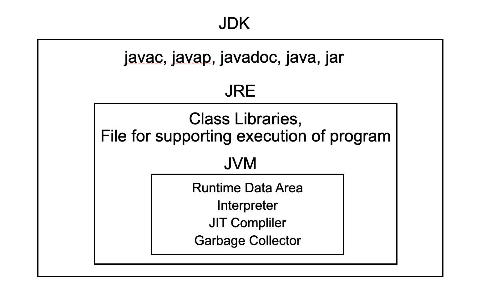
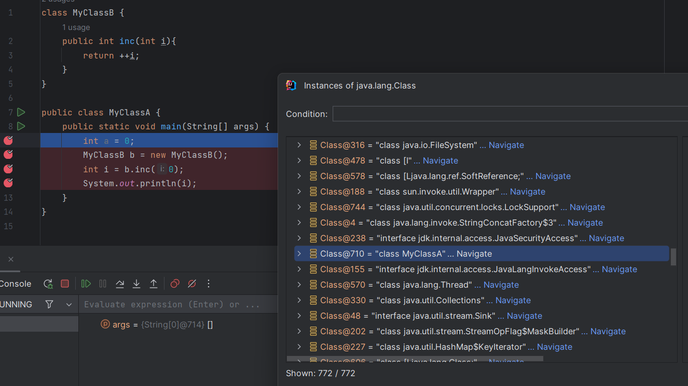
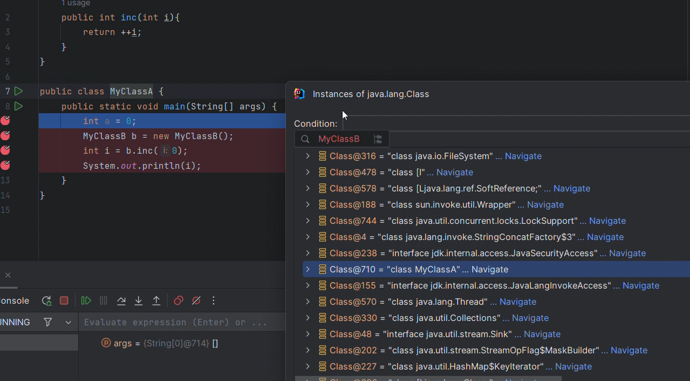
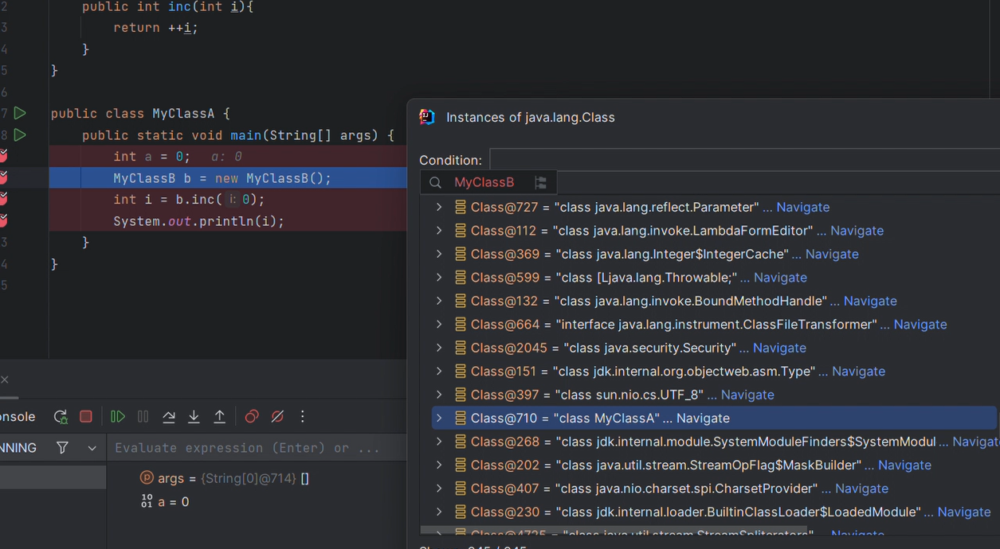
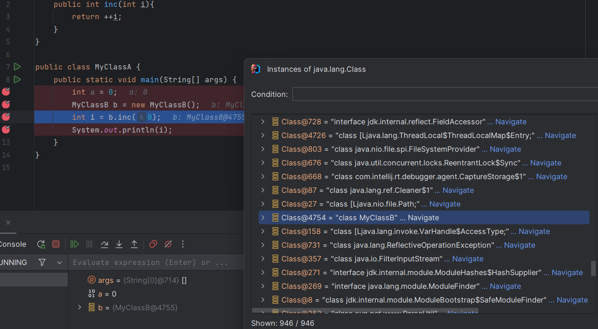
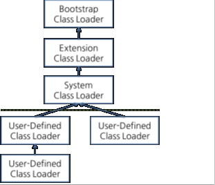
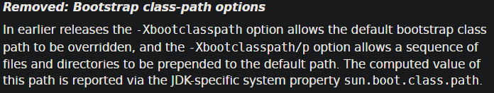
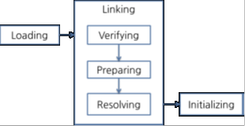

# JVM의 구조와 동작 방식


### JDK, JRE, JVM




* JDK는 자바 개발 환경으로 자바 어플리케이션을 개발하기 위해 필요한 도구를 제공합니다.
* JRE는 자바 실행 환경으로 JVM, 자바 클래스 라이브러리, 기타 자바 어플리케이션 실행에 필요한 파일들을 포함합니다.
* JVM은 자바 애플리케이션을 클래스 로더(Class Loader)를 통해 읽어 들여서 자바 API와 함께 실행합니다.


### JVM이란?

JVM(Java Virtual Machine)은 Java 애플리케이션을 실행하는 런타임 엔진 역할을 합니다. 

Java 애플리케이션을 WORA(Write Once Run Anywhere)라고 합니다. 이는 Java가 JVM을 사용하면 OS에 상관없이 하나의 바이트 코드로 모든 플랫폼에서 동작할 수 있는 기계 독립적 프로그래밍 언어로 설계되었기 때문입니다.

JVM 명세(The Java Virtual Machine Specification)를 따르기만 하면 어떤 벤더든 JVM을 개발하여 제공할 수 있습니다. 따라서 대표적인 오라클 핫스팟 JVM 외에도 IBM JVM을 비롯한 다양한 JVM이 존재합니다.


### 바이트 코드

WORA를 구현하기 위해 JVM은 사용자 언어인 자바와 기계어 사이의 중간 언어인 자바 바이트 코드를 사용합니다. 이 자바 바이트코드가 자바 코드를 배포하는 가장 작은 단위입니다.

JVM은 자바 바이트 코드를 실행하는 실행기입니다. 자바 컴파일러(javac)는 C/C++ 등의 컴파일러처럼 고수준 언어를 기계어, 즉 직접적인 CPU 명령으로 변환하는 것이 아니라, 개발자가 이해하는 자바 언어를 JVM이 이해하는 자바 바이트코드로 번역합니다.

따라서 자바 바이트코드는 플랫폼 의존적인 코드가 없기 때문에 JVM(정확하게 말하자면 같은 프로파일의 JRE)이 설치된 장비라면 CPU나 운영체제가 다르더라도 실행할 수 있습니다.


### JVM 구조


자바로 작성한 코드는 위 그림과 같은 과정을 통해 실행됩니다.

클래스 로더(Class Loader)가 컴파일된 자바 바이트코드를 런타임 데이터 영역(Runtime Data Areas)에 로드하고, 실행 엔진(Execution Engine)이 자바 바이트코드를 실행합니다.


### 클래스 로더

Java에서 클래스는 두가지 주요한 역할을 합니다. 

* 클래스는 Java의 타입 시스템의 구성 요소로 작용합니다. 즉, 객체 지향 프로그래밍에서 데이터와 메서드를 결합하여 캡슐화된 단위로 정의합니다.
* 클래스는 컴파일 단위로 작동합니다. 이것은 클래스가 개별적으로 로드되고 JVM 프로세스에서 실행될 수 있는 가장 작은 코드 조각이라는 것을 의미합니다.

클래스를 사용하여 프로그램을 모듈화하고 유지보수성을 높일 수 있으며, 동시에 프로그램을 조각으로 분할하여 로딩 및 실행을 효율적으로 관리할 수 있습니다.


### JVM에 클래스를 로드하는 메커니즘

JVM은 프로그램 실행 중에 모든 클래스를 미리 로드하지 않습니다. 대신, 해당 클래스가 필요한 시점에 동적으로 로드됩니다.

아래와 같은 Java 프로그램이 있다고 가정해 봅시다.

```java
class MyClassB {
    public int inc(int i){
        return ++i;
    }
}

public class MyClassA {
    public static void main(String[] args) {
        int a = 0;
        MyClassB b = new MyClassB();
        int i = b.inc(0);
        System.out.println(i);
    }
}
```

주어진 코드에서는 클래스 MyClassA의 main 메서드가 시작 지점(entry point)로 지정되어 있습니다. 프로그램이 실행될 때, JVM은 처음에 클래스 MyClassA를 로드하고 main 메서드를 실행합니다. 이 때 클래스 MyClassB는 main 메서드에서 호출될 때까지 로드되지 않습니다. 10번 라인이 실행될 때 클래스 MyClassB가 로드됩니다.

아래는 Intellij에서 디버깅 모드를 통해 로드된 클래스를 확인하는 것입니다.



현재 7번부터 8번 라인까지 실행되었는데 MyClassA 클래스만 로드되었습니다.



MyClassB 클래스는 로드되지 않았습니다.



9번 라인을 실행했을 때도 MyClassB 클래스는 로드되지 않았습니다.



10번 라인을 실행했을 때 MyClassB 클래스가 로드되었습니다. MyClassB 클래스의 생성자를 호출하였기 때문입니다. 이처럼 해당 클래스가 필요한 시점에 동적으로 로드됩니다.

다음 3가지 경우에 클래스가 로드됩니다.

* 클래스의 생성자를 호출할 때
* 클래스의 정적(static) 멤버에 접근할 때
* Reflection API를 사용할 때

클래스를 로드하기 위해 JVM은 클래스 로더(Classloader) 객체를 사용합니다. 이미 로드된 모든 클래스에는 자신을 로드한 클래스 로더에 대한 참조가 포함되어 있으며 자신의 클래스에서 참조되는 모든 클래스를 로드하는데 자신을 로드한 클래스 로더를 사용합니다. 

```java
 A.class.getClassLoader().loadClass("B")
```

위 코드와 같이 클래스 A에서 참조되는 클래스 B를 로드할 때 클래스 A를 로드한 클래스로더가 사용됩니다.

여기서 모든 클래스 로더는 클래스를 찾고 로드하는 데 사용할 수 있는 유형의 객체이므로 java.lang.Classloader가 로드되어 있어야 사용 가능합니다. 그런데 이런 클래스 로더 클래스는 어떻게 로드될까요?

JVM의 핵심 부분에 속하는 클래스 로더인 부트스트랩 클래스 로더가 이런 JVM 자체에 필요한 클래스를 로드합니다. 부트스트랩 클래스 로더는 JVM이 시작될 때 자동으로 로드되기 때문에 네이티브 코드로 작성되어 있습니다.


### 클래스 로더 계층 구조



JVM의 클래스 로더는 모든 클래스 로더가 상위 클래스를 갖는 트리 계층 구조로 구성됩니다. 클래스 로더가 특정 클래스를 로드하기 전에, 해당 클래스의 부모 클래스 로더가 이미 해당 클래스를 로드할 수 있는지 여부를 확인하고 클래스를 로드하기 때문에 반복적으로 클래스를 로드하는 것을 방지할 수 있습니다.

아래에서 실제 ClassLoader 클래스에서 클래스를 로드하는 메소드에 대해 알아보겠습니다.

```java
protected Class<?> loadClass(String name, boolean resolve)
        throws ClassNotFoundException
    {
        synchronized (getClassLoadingLock(name)) {
            // First, check if the class has already been loaded
            Class<?> c = findLoadedClass(name);
            if (c == null) {
                long t0 = System.nanoTime();
                try {
                    if (parent != null) {
                        c = parent.loadClass(name, false);
                    } else {
                        c = findBootstrapClassOrNull(name);
                    }
                } catch (ClassNotFoundException e) {
                    // ClassNotFoundException thrown if class not found
                    // from the non-null parent class loader
                }

                if (c == null) {
                    // If still not found, then invoke findClass in order
                    // to find the class.
                    long t1 = System.nanoTime();
                    c = findClass(name);

                    // this is the defining class loader; record the stats
                    PerfCounter.getParentDelegationTime().addTime(t1 - t0);
                    PerfCounter.getFindClassTime().addElapsedTimeFrom(t1);
                    PerfCounter.getFindClasses().increment();
                }
            }
            if (resolve) {
                resolveClass(c);
            }
            return c;
        }
    }
```

위 메소드는 java.lang.ClassLoader 클래스에서 클래스를 로드하는 메소드입니다. 

`Class<?> c = findLoadedClass(name);` : 이미 로드된 클래스들 중 내가 찾는 클래스가 있는지 확인하고 찾아서 반환받습니다.

`c = parent.loadClass(name, false);`  :  로드된 클래스가 없는 경우, 부모 클래스 로더(parent)를 통해 클래스를 로드하려고 시도합니다.

 `c = findBootstrapClassOrNull(name);` : 부모 클래스 로더가 없을 경우 네이티브 코드로 작성된 부트스트랩 클래스 로더의 자식 클래스이므로 부트스트랩 클래스 로더를 통해 클래스를 로드하려고 시도합니다. 

`c = findClass(name);` : 부모 클래스 로더가 클래스를 찾지 못하는 경우, 현재 클래스 로더에서 이 메서드를 호출하여 클래스를 직접 찾으려 시도합니다.

`resolveClass(c);` : 클래스를 찾은 후에 'resolve' 매개변수에 따라 클래스를 초기화하고 링크하는 작업을 수행합니다.

이러한 구조는 클래스 로더 간의 책임을 분리하고, 각 클래스 로더가 특정 위치에서 클래스를 로드하는 데만 책임을 지도록 합니다. 클래스 로더들 간의 협력을 통해 효율적인 클래스 로딩을 수행할 수 있습니다.

Java 애플리케이션에서 클래스 로더의 계층 구조를 살펴보고 일반적으로 어떤 클래스를 로드하는지 살펴보겠습니다. 

- 부트스트랩 클래스 로더(Bootstrap Class Loader): 클래스 로더 계층 구조의 루트에 있는 클래스 로더입니다. 위에서 설명했듯이 부트스트랩 클래스 로더는 JVM이 시작될 때 자동으로 로드되기 때문에 네이티브 코드로 작성되어 있습니다. JVM 자체를 실행하는 데 필요한 시스템 클래스를 로드합니다. 따라서 JVM이 실될 때 JDK 배포판과 함께 제공된 모든 클래스가 이 클래스 로더에 의해 로드됩니다. 

  ```bash
  java -Xbootclasspath/p:<path_to_classes>
  ```

  위 JVM 옵션은 JDK 8 까지 유효한 옵션이었습니다. 이 옵션을 사용하면 일련의 파일 및 디렉터리를 boot class path의 앞에 추가하여 JVM이 시작될 때 내가 추가한 클래스도 JDK와 함께 로드될 수 있습니다. JDK를 재정의할 수 있는 것입니다. `<path_to_classes>`는 부트스트랩 클래스 로더가 로드할 클래스들이 포함된 디렉토리 또는 JAR 파일의 경로를 나타냅니다. JDK 9 이후에는 `-Xbootclasspath`옵션과 `-Xbootclasspath/p` 옵션은 사라지고 `--patch-module`를 통해 JDK를 재정의할 수 있습니다.

  

  위 설명은 openjdk에서 JDK 9버전에서 전과 바뀐 내용을 설명한 것입니다.  `-Xbootclasspath`옵션과 `-Xbootclasspath/p` 옵션은 사라졌다는 것을 알 수 있습니다.

  

  위 설명은 --patch-module이 -Xbootclasspath/p 옵션을 대체한다는 것입니다.

  ```bash
  --patch-module <module>=<file>(<pathsep><file>)*
  ```

  여기서 `<module>`는 모듈 이름이고 `<file>`는 모듈 정의의 파일 시스템 경로 이름이며 `<pathsep>`는 호스트 플랫폼의 경로 구분 문자입니다. JDK 9 이상 버전에서 이런 옵션으로  `-Xbootclasspath/p`옵션을 대체할 수 있습니다.

  `-Xbootclasspath/a` 옵션은 boot class path 뒤에 내가 정의한 class의 집합을 추가할 수 있습니다. 이 옵션은 JDK 9버전 이후에도 사용할 수 있습니다. 이 옵션은 boot class path뒤에 class를 추가하는 것이라 JDK를 재정의할 수는 없습니다. 이 옵션을 사용하면 부트스트랩 클래스 로더가 로드할 수 있는 클래스의 집합을 확장할 수 있습니다.

- 확장 클래스 로더(Extension Class Loader): 부트스트랩 클래스로더(bootstrap class loader)의 하위 클래스로, 확장 디렉토리(extension directories)에서 클래스를 로드하는 역할을 합니다.

  이 확장 디렉토리에 위치한 클래스들은 일반적으로 시스템의 환경이나 구성과 관련된 것들로 사용됩니다. 예를 들어, 로케일(locales), 보안 제공자(security providers) 등과 같은 기계별 구성(machine-specific configuration)을 지정하는 데 사용될 수 있습니다. 로케일은 언어, 지역 및 문화적 규칙에 관련된 정보입니다. Java에서는 `java.util.Locale` 클래스를 사용하여 로케일을 나타냅니다. 보안 제공자는 암호화, 서명, 해시 등과 같은 보안 기능을 제공하는 소프트웨어 모듈입니다. 보안 제공자는 Java의 `java.security.Provider` 클래스를 구현합니다. 

  JDK 9 버전 이후에는 확장 클래스 로더가 플랫폼 클래스 로더(Platform Class Loader)로 바뀌었다고 합니다.

- 시스템 클래스 로더(System Class Loader): 애플리케이션 클래스와 클래스패스(classpath)에 있는 클래스들을 로드하는 역할을 합니다. 사용자는 `-cp` 옵션을 사용하여 클래스패스를 지정할 수 있습니다. 

  ```bash
  java -cp <classpath> MainClass
  ```

  여기서 `<classpath>`는 클래스를 검색할 위치를 지정하는 문자열입니다. 이것은 디렉토리의 경로나 JAR 파일의 경로, 또는 이들을 쉼표(,)로 구분한 목록일 수 있습니다.

- 웹 애플리케이션 클래스 로더(The class-loader hierarchy of web applications): 웹 애플리케이션은 여러 개가 동시에 애플리케이션 서버에 배포될 수 있으며, 서로 다른 애플리케이션은 서로의 클래스를 구별할 수 있어야 합니다. 따라서 각 웹 애플리케이션은 자체 클래스 로더를 사용합니다.

  이러한 격리를 통해 단일 서버에 배포된 다양한 웹 애플리케이션이 충돌 없이 동일한 라이브러리의 다양한 버전을 가질 수 있습니다. 웹 애플리케이션 클래스 로더가 먼저 상위 클래스 로더에 검색을 위임하는 대신 애플리케이션의 WAR 파일에 패키지된 클래스를 찾으려고 시도합니다.

### 동일한 패키지 이름을 가진 여러 클래스를 발견하면?

보통 클래스 로더는 클래스를 로드할 때 클래스패스에 지정된 디렉토리나 JAR 파일을 순차적으로 탐색합니다. 이 때 클래스패스에 지정된 디렉토리나 JAR 파일의 순서가 중요합니다. 만약 클래스 로더가 동일한 패키지 및 클래스 이름을 가진 클래스를 발견하면, 첫 번째로 발견된 클래스가 로드됩니다.

### Resolution, Linking, and  Verification

클래스를 찾으면 검증(verified), 준비(prepared), 분석(resolved) 및 초기화(initialized)됩니다.



- 로드: 클래스를 파일에서 가져와서 JVM의 메모리에 로드합니다.

- 검증(Verification): 클래스가 손상되지 않았고 구조적으로 올바른지를 확인하는 과정입니다. 다음과 같은 사항들이 확인됩니다.

  1. 런타임 상수 풀의 유효성: 클래스의 런타임 상수 풀(runtime constant pool)이 올바른지 확인됩니다. 런타임 상수 풀은 클래스의 상수 및 리터럴 값들을 저장하는데 사용됩니다.
  2. 변수 타입의 정확성: 클래스의 변수들의 타입이 올바른지 확인됩니다. 이는 변수들이 잘못된 데이터 타입으로 사용되지 않도록 보장합니다.
  3. 변수 초기화: 변수가 사용되기 전에 초기화되었는지 확인됩니다. 이는 변수가 사용되기 전에 유효한 값으로 초기화되었는지를 보장합니다.

  이러한 검증 과정이 경우에 따라서는 필요하지 않은 경우도 있습니다. 예를 들어, 잠재적으로 악성 코드가 실행되지 않는 환경이라면 엄격한 검증이 필요하지 않을 수 있습니다. 검증을 비활성화하면 JVM의 시작 시간을 단축시킬 수 있습니다. 따라서 개발 환경에서는 검증을 비활성화하는 것이 허용되는 경우가 많습니다.

  검증을 비활성화하는 명령어는 다음과 같습니다.

  ```bash
  java -noverify -jar YourApplication.jar
  ```

- 준비(Preparation): 클래스의 정적(static) 필드들을 해당하는 데이터 타입의 기본값으로 초기화됩니다. 이는 해당 클래스의 정적 필드들이 메모리에 할당되고 사용할 수 있도록 하는 과정입니다. 예를 들어, int 타입은 0으로 초기화됩니다.

- 분석(Resolution): 런타임 상수 풀(runtime constant pool)에 있는 심볼릭 참조가 실제로 필요한 타입의 유효한 클래스를 가리키는지를 확인합니다. 심볼릭 참조는 정적으로 구현되어 있는 클래스, 메소드, 필드를 참조를 의미합니다. 즉, 해당 심볼릭 참조가 정확하게 클래스 파일에 정의된 타입을 가리키고 있는지를 확인하여 올바른 클래스를 로드하고 사용할 수 있도록 합니다. 이를 통해 클래스 파일이 올바르게 해석되고 실행될 수 있도록 보장합니다. 이 과정은 해당 클래스가 실제로 사용될 때까지 지연될 수 있습니다. 불필요한 자원을 소비하지 않도록 하는 것입니다.

- 초기화(Initialization): 클래스 변수들을 적절한 값으로 초기화합니다. 즉, static initializer들을 수행하고, static 필드들을 설정된 값으로 초기화합니다.

  

### 런타임 데이터 영역


런타임 데이터 영역은 JVM이라는 프로그램이 운영체제 위에서 실행되면서 할당받는 메모리 영역입니다. 런타임 데이터 영역은 6개의 영역으로 나눌 수 있습니다. 이중 PC 레지스터(PC Register), JVM 스택(JVM Stack), 네이티브 메서드 스택(Native Method Stack)은 스레드마다 하나씩 생성되며 힙(Heap), 메서드 영역(Method Area), 런타임 상수 풀(Runtime Constant Pool)은 모든 스레드가 공유해서 사용합니다.

- PC 레지스터: PC(Program Counter) 레지스터는 각 스레드마다 하나씩 존재하며 스레드가 시작될 때 생성됩니다. PC 레지스터는 현재 수행 중인 JVM 명령의 주소를 갖습니다.
- JVM 스택: JVM 스택은 각 스레드마다 하나씩 존재하며 스레드가 시작될 때 생성됩니다. 스택 프레임(Stack Frame)이라는 구조체를 저장하는 스택으로, JVM은 오직 JVM 스택에 스택 프레임을 추가하고(push) 제거하는(pop) 동작만 수행합니다. 예외 발생 시 printStackTrace() 등의 메서드로 보여주는 Stack Trace의 각 라인은 하나의 스택 프레임을 표현합니다.


- 스택 프레임: JVM 내에서 메서드가 수행될 때마다 하나의 스택 프레임이 생성되어 해당 스레드의 JVM 스택에 추가되고 메서드가 종료되면 스택 프레임이 제거됩니다. 각 스택 프레임은 지역 변수 배열(Local Variable Array), 피연산자 스택(Operand Stack), 현재 실행 중인 메서드가 속한 클래스의 런타임 상수 풀에 대한 레퍼런스를 갖습니다. 지역 변수 배열, 피연산자 스택의 크기는 컴파일 시에 결정되기 때문에 스택 프레임의 크기도 메서드에 따라 크기가 고정됩니다.
- 지역 변수 배열: 0부터 시작하는 인덱스를 가진 배열입니다. 0은 메서드가 속한 클래스 인스턴스의 this 레퍼런스이고, 1부터는 메서드에 전달된 파라미터들이 저장되며, 메서드 파라미터 이후에는 메서드의 지역 변수들이 저장됩니다.
- 피연산자 스택: 메서드의 실제 작업 공간입니다. 각 메서드는 피연산자 스택과 지역 변수 배열 사이에서 데이터를 교환하고, 다른 메서드 호출 결과를 추가하거나(push) 꺼냅니다(pop). 피연산자 스택 공간이 얼마나 필요한지는 컴파일할 때 결정할 수 있으므로, 피연산자 스택의 크기도 컴파일 시에 결정됩니다.
- 네이티브 메서드 스택: 자바 외의 언어로 작성된 네이티브 코드를 위한 스택입니다. 즉, JNI(Java Native Interface)를 통해 호출하는 C/C++ 등의 코드를 수행하기 위한 스택으로, 언어에 맞게 C 스택이나 C++ 스택이 생성됩니다.
- 메서드 영역: 메서드 영역은 모든 스레드가 공유하는 영역으로 JVM이 시작될 때 생성됩니다. JVM이 읽어 들인 각각의 클래스와 인터페이스에 대한 런타임 상수 풀, 필드와 메서드 정보, Static 변수, 메서드의 바이트코드 등을 보관합니다. 메서드 영역은 JVM 벤더마다 다양한 형태로 구현할 수 있으며, 오라클 핫스팟 JVM(HotSpot JVM)에서는 흔히 Permanent Area, 혹은 Permanent Generation(PermGen)이라고 불립니다. 메서드 영역에 대한 가비지 컬렉션은 JVM 벤더의 선택 사항입니다.
- 런타임 상수 풀: 클래스 파일 포맷에서 constant_pool 테이블에 해당하는 영역입니다. 메서드 영역에 포함되는 영역이긴 하지만, JVM 동작에서 가장 핵심적인 역할을 수행하는 곳이기 때문에 JVM 명세에서도 따로 중요하게 기술합니다. 각 클래스와 인터페이스의 상수뿐만 아니라, 메서드와 필드에 대한 모든 레퍼런스까지 담고 있는 테이블입니다. 즉, 어떤 메서드나 필드를 참조할 때 JVM은 런타임 상수 풀을 통해 해당 메서드나 필드의 실제 메모리상 주소를 찾아서 참조합니다.
- 힙: 인스턴스 또는 객체를 저장하는 공간으로 가비지 컬렉션 대상입니다. JVM 성능 등의 이슈에서 가장 많이 언급되는 공간입니다. 힙 구성 방식이나 가비지 컬렉션 방법 등은 JVM 벤더의 재량입니다.

### 실행 엔진

클래스 로더를 통해 JVM 내의 런타임 데이터 영역에 배치된 바이트코드는 실행 엔진에 의해 실행됩니다.

### Reference

* https://openjdk.org/jeps/261
* https://docs.oracle.com/en/java/javase/11/docs/api/java.base/java/lang/ClassLoader.html
* https://blogs.oracle.com/javamagazine/post/how-the-jvm-locates-loads-and-runs-libraries
* https://velog.io/@sgwon1996/JAVA%EC%9D%98-%EB%8F%99%EC%9E%91-%EC%9B%90%EB%A6%AC%EC%99%80-JVM-%EA%B5%AC%EC%A1%B0
* https://d2.naver.com/helloworld/1230
* https://velog.io/@sgwon1996/JAVA%EC%9D%98-%EB%8F%99%EC%9E%91-%EC%9B%90%EB%A6%AC%EC%99%80-JVM-%EA%B5%AC%EC%A1%B0


