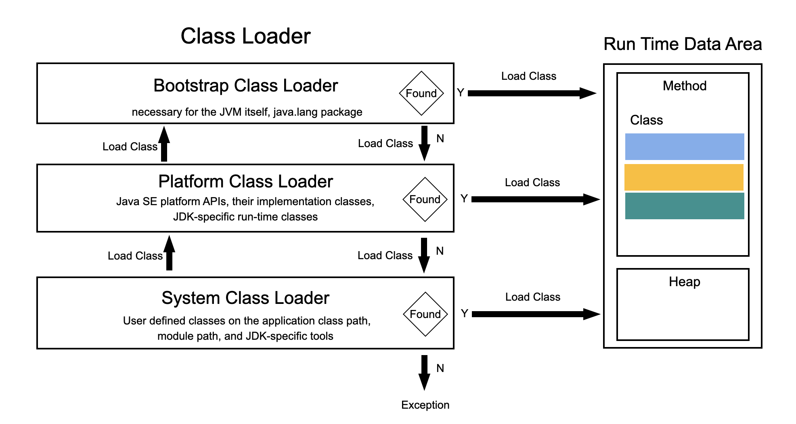

# JVM의 구조와 동작 방식

### JDK, JRE, JVM

* JDK는 자바 개발 환경으로 자바 어플리케이션을 개발하기 위해 필요한 도구를 제공합니다.
* JRE는 자바 실행 환경으로 JVM, 자바 클래스 라이브러리, 기타 자바 어플리케이션 실행에 필요한 파일들을 포함합니다.
* JVM은 자바 애플리케이션을 클래스 로더(Class Loader)를 통해 읽어 들여서 자바 API와 함께 실행합니다.

### JVM이란?

JVM(Java Virtual Machine)은 Java 애플리케이션을 실행하는 런타임 엔진 역할을 합니다. 

Java 애플리케이션을 WORA(Write Once Run Anywhere)라고 합니다. 이는 Java가 JVM을 사용하면 OS에 상관없이 하나의 바이트 코드로 모든 플랫폼에서 동작할 수 있는 기계 독립적 프로그래밍 언어로 설계되었기 때문입니다.

JVM 명세(The Java Virtual Machine Specification)를 따르기만 하면 어떤 벤더든 JVM을 개발하여 제공할 수 있습니다. 따라서 대표적인 오라클 핫스팟 JVM 외에도 IBM JVM을 비롯한 다양한 JVM이 존재합니다.

### 바이트 코드

WORA를 구현하기 위해 JVM은 사용자 언어인 자바와 기계어 사이의 중간 언어인 자바 바이트 코드를 사용합니다. 이 자바 바이트코드가 자바 코드를 배포하는 가장 작은 단위입니다.

JVM은 자바 바이트 코드를 실행하는 실행기입니다. 자바 컴파일러(javac)는 C/C++ 등의 컴파일러처럼 고수준 언어를 기계어, 즉 직접적인 CPU 명령으로 변환하는 것이 아니라, 개발자가 이해하는 자바 언어를 JVM이 이해하는 자바 바이트코드로 번역합니다.

따라서 자바 바이트코드는 플랫폼 의존적인 코드가 없기 때문에 JVM(정확하게 말하자면 같은 프로파일의 JRE)이 설치된 장비라면 CPU나 운영체제가 다르더라도 실행할 수 있습니다.

### JVM 구조

자바로 작성한 코드는 위 그림과 같은 과정을 통해 실행됩니다.

클래스 로더(Class Loader)가 컴파일된 자바 바이트코드를 런타임 데이터 영역(Runtime Data Areas)에 로드하고, 실행 엔진(Execution Engine)이 자바 바이트코드를 실행합니다.

### 클래스 로더

자바는 동적 로드, 즉 컴파일타임이 아니라 런타임에 클래스를 처음으로 참조할 때 해당 클래스를 로드하고 링크하는 특징이 있습니다. 이 동적 로드를 담당하는 부분이 JVM의 클래스 로더입니다.

##### 특징

- 계층 구조: 클래스 로더끼리 부모-자식 관계를 이루어 계층 구조로 생성됩니다. 최상위 클래스 로더는 부트스트랩 클래스 로더(Bootstrap Class Loader)입니다.
- 위임 모델: 계층 구조를 바탕으로 클래스 로더끼리 로드를 위임하는 구조로 동작합니다. 클래스를 로드할 때 먼저 상위 클래스 로더를 확인하여 상위 클래스 로더에 있다면 해당 클래스를 사용하고, 없다면 로드를 요청받은 클래스 로더가 클래스를 로드합니다.
- 가시성(visibility) 제한: 하위 클래스 로더는 상위 클래스 로더의 클래스를 찾을 수 있지만, 상위 클래스 로더는 하위 클래스 로더의 클래스를 찾을 수 없습니다.
- 언로드 불가: 클래스 로더는 클래스를 로드할 수는 있지만 언로드할 수는 없습니다. 언로드 대신, 현재 클래스 로더를 삭제하고 아예 새로운 클래스 로더를 생성하는 방법을 사용할 수 있습니다.

클래스 로더가 클래스 로드를 요청받으면, 클래스 로더 캐시, 상위 클래스 로더, 자기 자신의 순서로 해당 클래스가 있는지 확인합니다. 즉, 이전에 로드된 클래스인지 클래스 로더 캐시를 확인하고, 없으면 상위 클래스 로더를 거슬러 올라가며 확인합니다. 부트스트랩 클래스 로더까지 확인해도 없으면 요청받은 클래스 로더가 파일 시스템에서 해당 클래스를 찾습니다.

- 부트스트랩 클래스 로더: JVM을 기동할 때 생성되며, Object 클래스들을 비롯하여 자바 API들을 로드합니다. 다른 클래스 로더와 달리 자바가 아니라 네이티브 코드로 구현되어 있습니다.
- 익스텐션 클래스 로더(Extension Class Loader): 기본 자바 API를 제외한 확장 클래스들을 로드합니다. 다양한 보안 확장 기능 등을 여기에서 로드하게 됩니다.
- 시스템 클래스 로더(System Class Loader): 부트스트랩 클래스 로더와 익스텐션 클래스 로더가 JVM 자체의 구성 요소들을 로드하는 것이라 한다면, 시스템 클래스 로더는 애플리케이션의 클래스들을 로드한다고 할 수 있습니다. 사용자가 지정한 $CLASSPATH 내의 클래스들을 로드합니다.
- 사용자 정의 클래스 로더(User-Defined Class Loader): 애플리케이션 사용자가 직접 코드 상에서 생성해서 사용하는 클래스 로더입니다.

클래스 로더가 아직 로드되지 않은 클래스를 찾으면, 다음 그림과 같은 과정을 거쳐 클래스를 로드하고 링크하고 초기화합니다.

- 로드: 클래스를 파일에서 가져와서 JVM의 메모리에 로드합니다.

- 검증(Verifying): 읽어 들인 클래스가 자바 언어 명세(Java Language Specification) 및 JVM 명세에 명시된 대로 잘 구성되어 있는지 검사합니다. 클래스 로드의 전 과정 중에서 가장 까다로운 검사를 수행하는 과정으로서 가장 복잡하고 시간이 많이 걸립니다. JVM TCK의 테스트 케이스 중에서 가장 많은 부분이 잘못된 클래스를 로드하여 정상적으로 검증 오류를 발생시키는지 테스트하는 부분입니다.

- 준비(Preparing): 클래스가 필요로 하는 메모리를 할당하고, 클래스에서 정의된 필드, 메서드, 인터페이스들을 나타내는 데이터 구조를 준비합니다.

- 분석(Resolving): 클래스의 상수 풀 내 모든 심볼릭 레퍼런스를 다이렉트 레퍼런스로 변경합니다.

- 초기화: 클래스 변수들을 적절한 값으로 초기화합니다. 즉, static initializer들을 수행하고, static 필드들을 설정된 값으로 초기화합니다.

  

### 런타임 데이터 영역

런타임 데이터 영역은 JVM이라는 프로그램이 운영체제 위에서 실행되면서 할당받는 메모리 영역입니다. 런타임 데이터 영역은 6개의 영역으로 나눌 수 있습니다. 이중 PC 레지스터(PC Register), JVM 스택(JVM Stack), 네이티브 메서드 스택(Native Method Stack)은 스레드마다 하나씩 생성되며 힙(Heap), 메서드 영역(Method Area), 런타임 상수 풀(Runtime Constant Pool)은 모든 스레드가 공유해서 사용합니다.

- PC 레지스터: PC(Program Counter) 레지스터는 각 스레드마다 하나씩 존재하며 스레드가 시작될 때 생성됩니다. PC 레지스터는 현재 수행 중인 JVM 명령의 주소를 갖습니다.
- JVM 스택: JVM 스택은 각 스레드마다 하나씩 존재하며 스레드가 시작될 때 생성됩니다. 스택 프레임(Stack Frame)이라는 구조체를 저장하는 스택으로, JVM은 오직 JVM 스택에 스택 프레임을 추가하고(push) 제거하는(pop) 동작만 수행합니다. 예외 발생 시 printStackTrace() 등의 메서드로 보여주는 Stack Trace의 각 라인은 하나의 스택 프레임을 표현합니다.

- 스택 프레임: JVM 내에서 메서드가 수행될 때마다 하나의 스택 프레임이 생성되어 해당 스레드의 JVM 스택에 추가되고 메서드가 종료되면 스택 프레임이 제거됩니다. 각 스택 프레임은 지역 변수 배열(Local Variable Array), 피연산자 스택(Operand Stack), 현재 실행 중인 메서드가 속한 클래스의 런타임 상수 풀에 대한 레퍼런스를 갖습니다. 지역 변수 배열, 피연산자 스택의 크기는 컴파일 시에 결정되기 때문에 스택 프레임의 크기도 메서드에 따라 크기가 고정됩니다.
- 지역 변수 배열: 0부터 시작하는 인덱스를 가진 배열입니다. 0은 메서드가 속한 클래스 인스턴스의 this 레퍼런스이고, 1부터는 메서드에 전달된 파라미터들이 저장되며, 메서드 파라미터 이후에는 메서드의 지역 변수들이 저장됩니다.
- 피연산자 스택: 메서드의 실제 작업 공간입니다. 각 메서드는 피연산자 스택과 지역 변수 배열 사이에서 데이터를 교환하고, 다른 메서드 호출 결과를 추가하거나(push) 꺼냅니다(pop). 피연산자 스택 공간이 얼마나 필요한지는 컴파일할 때 결정할 수 있으므로, 피연산자 스택의 크기도 컴파일 시에 결정됩니다.
- 네이티브 메서드 스택: 자바 외의 언어로 작성된 네이티브 코드를 위한 스택입니다. 즉, JNI(Java Native Interface)를 통해 호출하는 C/C++ 등의 코드를 수행하기 위한 스택으로, 언어에 맞게 C 스택이나 C++ 스택이 생성됩니다.
- 메서드 영역: 메서드 영역은 모든 스레드가 공유하는 영역으로 JVM이 시작될 때 생성됩니다. JVM이 읽어 들인 각각의 클래스와 인터페이스에 대한 런타임 상수 풀, 필드와 메서드 정보, Static 변수, 메서드의 바이트코드 등을 보관합니다. 메서드 영역은 JVM 벤더마다 다양한 형태로 구현할 수 있으며, 오라클 핫스팟 JVM(HotSpot JVM)에서는 흔히 Permanent Area, 혹은 Permanent Generation(PermGen)이라고 불립니다. 메서드 영역에 대한 가비지 컬렉션은 JVM 벤더의 선택 사항입니다.
- 런타임 상수 풀: 클래스 파일 포맷에서 constant_pool 테이블에 해당하는 영역입니다. 메서드 영역에 포함되는 영역이긴 하지만, JVM 동작에서 가장 핵심적인 역할을 수행하는 곳이기 때문에 JVM 명세에서도 따로 중요하게 기술합니다. 각 클래스와 인터페이스의 상수뿐만 아니라, 메서드와 필드에 대한 모든 레퍼런스까지 담고 있는 테이블입니다. 즉, 어떤 메서드나 필드를 참조할 때 JVM은 런타임 상수 풀을 통해 해당 메서드나 필드의 실제 메모리상 주소를 찾아서 참조합니다.
- 힙: 인스턴스 또는 객체를 저장하는 공간으로 가비지 컬렉션 대상입니다. JVM 성능 등의 이슈에서 가장 많이 언급되는 공간입니다. 힙 구성 방식이나 가비지 컬렉션 방법 등은 JVM 벤더의 재량입니다.

### 실행 엔진

클래스 로더를 통해 JVM 내의 런타임 데이터 영역에 배치된 바이트코드는 실행 엔진에 의해 실행됩니다.