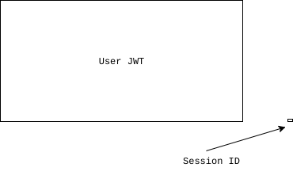
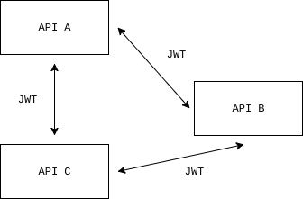

# JWT와 Session 비교


### 크기



쿠키와 JWT에 각각 사용자ID(abc123)을 저장

```json
{
  "iss": "https://api.mywebsite.com",
  "sub": "abc123",
  "nbf": 1497934977,
  "exp": 1497938577,
  "iat": 1497934977,
  "jti": "1234567",
  "typ": "authtoken"
}
```

세션의 경우, Cookie에 세션ID만 실어 보내면 되므로 전체 크기가 6바이트인데 JWT는 ID를 저장하면 사용자 인증 정보, 토큰의 발급시각, 만료시각, 토큰의 ID 등 담겨 있는 정보가 세션 ID에 비해 많으므로 기본 헤더 필드만 설정해도 전체 크기가 304바이트로 늘어난다고 한다. 세션 방식보다 훨씬 많은 네트워크 트래픽을 사용하는 것이다.

### 

### 안전성과 보안성

* 세션은 모든 인증 정보가 서버에 있기 때문에 보안적인 측면에서 JWT보다 조금 더 유리하다.

* 세션 ID가 해커에게 탈취당해도 서버에서 해당 세션을 무효처리하면 된다.

* 하지만 토큰의 경우 클라이언트가 인증정보를 가지고 있고 탈취 당하면 refresh token을 이용한 복잡한 방식으로 해킹을 막아야 한다.

* 또 JWT는 토큰에 실린 Payload가 별도로 암호화 되어있지 않으므로, 누구나 내용을 확인할 수 있다.

  

### 확장성

* JWT는 확장성에 강하다.
* 일반적으로 웹 어플리케이션의 서버 확장 방식은 수평 확장(scale-out)을 사용한다.
* 세션 인증 방식은 수평 확장을 할 때 세션 불일치 문제를 겪게 된다. 이를 해결하기 위해 Sticky Session, Session Clustering, 세션 스토리지 외부 분리 등의 작업을 해주어야한다.
* 하지만 JWT는 클라이언트가 인증 정보를 가지고 있기 때문에 세션 불일치 문제로부터 자유롭다. HTTP의 비상태성(Stateless)를 그대로 활용할 수 있고, 따라서 높은 확장성을 가질 수 있다.

### 서버의 부담

* 세션 인증 방식은 서버에 세션 데이터를 직접 저장하고 관리하다 보니 세션 데이터의 양이 많아질수록 서버의 부담이 증가한다.
* 하지만 JWT는 클라이언트가 인증 데이터를 가지고 있기 때문에 유저의 수가 많아져도 서버에 부담이 가지 않는다.

### 차이점  정리

* JWT는 stateless하고 세션은 stateful하다. JWT는 서버가 클라이언트의 상태를 보존하지 않고 세션은 보존한다는 뜻이다.

* 물론 JWT가 완전히 stateless하지는 않다. 보안문제로 Refresh Token을 도입하면 결국 이를 저장하기위한 별도의 저장소가 필요한건 마찬가지이기 때문이다.

* JWT등장 배경을 살펴보면, 보안이 뛰어나서가 아니라, 마이크로 서비스 아키텍처(MSA)가 도입되면서 주목 받기 시작한 방식이다.

* 수천 수만가지의 서버 to 서버 통신이 이루어지는 아키텍처에서 중앙화된 사용자 식별 저장소를 통해 각 API요청을 인증처리 해야한다면 인증 서버만 수백대가 필요할 것이다. 이렇기 때문에 인증 서버가 필요없는 JWT가 MSA환경에서 유용하다.

  