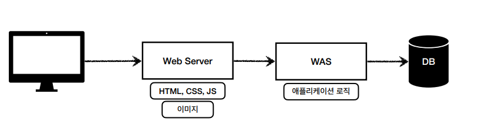
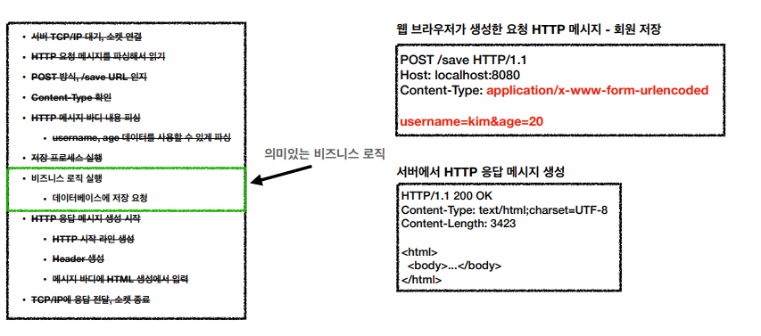

# 스프링 MVC

### 웹 서버(Web Server)

HTTP 기반으로 동작

정적 리소스 제공, 기타 부가기능

정적(파일) HTML, CSS, JS, 이미지, 영상

예) NGINX, APACHE

### 웹 애플리케이션 서버(WAS - Web Application Server)

HTTP 기반으로 동작

웹 서버 기능 포함+ (정적 리소스 제공 가능)

프로그램 코드를 실행해서 애플리케이션 로직 수행

동적 HTML, HTTP API(JSON)

서블릿, JSP, 스프링 MVC

예) Tomcat, Jetty, Undertow

### 웹 시스템 구성 - WEB, WAS, DB

정적 리소스는 웹 서버가 처리

웹 서버는 동적인 처리가 필요하면 WAS에 요청 위임

WAS는 중요한 애플리케이션 로직 처리 전담

효율적인 리소스 관리

WAS, DB 장애시 웹 서버가 오류 화면 제공 가능

### 서블릿

HTTP 요청시 WAS는 Request, Response 객체를 새로 만들어서 서블릿 객체를 호출해서 파라미터로 넘겨줌

개발자는 Request 객체에서 HTTP 요청 정보를 사용

개발자는 Response 객체에 HTTP 응답 정보를 입력

WAS는 Response 객체로 HTTP 응답 정보를 생성

### 서블릿 컨테이너

톰캣처럼 서블릿을 지원하는 WAS를 서블릿 컨테이너라고 함

서블릿 컨테이너는 서블릿 객체를 생성, 초기화, 호출, 종료하는 생명주기 관리

서블릿 객체는 싱글톤으로 관리

최초 로딩 시점에 서블릿 객체를 미리 만들어두고 재활용

공유 변수 사용 주의

JSP도 서블릿으로 변환 되어서 사용

동시 요청을 위한 멀티 쓰레드 처리 지원

### 동시 요청 - 멀티 쓰레드

요청 마다 쓰레드 생성 장단점

장점 

1. 동시 요청을 처리

2. 리소스(CPU, 메모리)가 허용할 때 까지 처리가능

단점

1. 쓰레드는 생성 비용이 비쌈 -> 응답 속도가 늦어짐

2. 컨텍스트 스위칭 비용이 발생

3. 쓰레드 생성에 제한이 없어서 서버가 다운 가능

### 쓰레드 풀

필요한 쓰레드를 쓰레드 풀에 보관하고 관리

톰캣은 최대 200개 기본 설정

쓰레드가 필요하면, 생성되어 있는 쓰레드를 쓰레드 풀에서 꺼내서 사용하고 반납

모두 사용중이면 요청을 거절하거나 특정 숫자만큼만 대기하도록 설정 가능

장점

1. 쓰레드가 미리 생성되어 있으므로 생성하고 종료하는 비용 절약, 응답 시간 빠름

2. 생성 가능한 쓰레드의 최대치가 있으므로 많은 요청이 들어와도 기존 요청 안전하게 처리 가능

### 쓰레드 풀 실무 팁

WAS의 주요 튜닝 포인트는 최대 쓰레드(max thread) 수이다.

너무 낮게 설정하면 클라이언트는 금방 응답이 지연되고 서버 리소스를 효율적으로 사용하지 못하게 된다.

너무 높게 설정하면 서버 리소스 임계점 초과로 다운된다.

장애 발생시에는 클라우드면 서버부터 늘리고 이후에 튜닝

아니면 평소에 튜닝

성능 테스트 

최대한 실제 서비스와 유사하게 성능 테스트 시도

툴: 아파치 ab, 제이미터, nGrinder

### WAS의 멀티 쓰레드 지원

멀티 쓰레드에 대한 부분은 WAS가 처리

멀티 쓰레드 환경이므로 싱글톤 객체(서블릿, 스프링 빈)는 주의해서 사용

#### 백엔드 개발자는 정적리소스, 동적인 HTML페이지, HTTP API를 어떻게 제공할 지 고민해야함

### SSR - 서버 사이드 렌더링

서버에서 최종 HTML을 생성해서 클라이언트에 전달

### CSR - 클라이언트 사이드 렌더링

HTML 결과를 자바스크립트를 사용해 웹 브라우저에서 동적으로 생성해서 적용

1. HTML 요청 -> HTML내용X 자바스크립트 링크
2. 자바스크립트 요청 -> Javascript 클라이언트 로직 HTML 렌더링 코드
3. HTTP API 데이터 요청 -> JSON

### HTTP 요청 데이터

GET - 쿼리 파라미터

1. /url?username=hello&age=20
2. 메시지 바디 없이, URL의 쿼리 파라미터에 데이터를 포함해서 전달
3. 예) 검색, 필터, 페이징등에서 많이 사용

POST - HTML Form

1. content-type: application/x-www-form-urlencoded
2. 메시지 바디에 쿼리 파라미터 형식으로 전달 username=hello&age=20
3. 예) 회원 가입, 상품 주문, HTML Form 사용

HTTP message body 에 데이터를 직접 담아서 요청

1. HTTP API에서 주로 사용, JSON, XML, TEXT
2. 데이터 형식은 주로 JSON 사용
3. POST, PUT, PATCH

